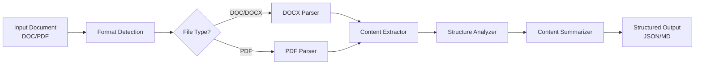

[English](README.md) | [中文](README_CN.md)

<div align="center">

# 📖 doc-content-analysis

**Document Content Reading & Analysis Agent**

*Effortlessly extract, parse, and analyze content from DOC and PDF documents using AI-powered intelligent processing.*

[](https://www.python.org/downloads/)
[](LICENSE)
[](https://www.microsoft.com/windows)

[Quick Start](#quick-start) · [Features](#features) · [Architecture](#architecture) · [Documentation](#documentation)

</div>

---

## Why doc-content-analysis?

Extracting and understanding document content is the foundation of intelligent document processing. **doc-content-analysis** provides a robust, modular pipeline for reading and analyzing DOC/DOCX and PDF files:

| Challenge | Solution |
|-----------|----------|
| ❌ Manual copy-paste and reading | ✅ Automated document parsing |
| ❌ PDF text extraction with layout loss | ✅ Intelligent layout-aware extraction |
| ❌ Mixed content (text, tables, images) | ✅ Structured content output |
| ❌ Difficult cross-document comparison | ✅ Unified content representation |
| ❌ No metadata or structure info | ✅ Rich document metadata extraction |

---

## Features

### 🎯 Core Capabilities

- **Multi-Format Support** - Read both DOC/DOCX and PDF documents seamlessly
- **Intelligent Content Extraction** - Extract text, tables, images, headers, footnotes, and metadata
- **Structured Output** - Generate structured JSON representations of document content
- **Non-Destructive Processing** - Original files are never modified

### 📄 Format Support

| Format | Extension | Description |
|--------|-----------|-------------|
| Microsoft Word | `.doc`, `.docx` | Word documents with full structure preservation |
| PDF | `.pdf` | Portable Document Format with layout-aware extraction |
| Plain Text | `.txt` | Plain text file reading and processing |

### 🔧 Processing Features

- **DOC/DOCX Parsing** - Extract paragraphs, headings, tables, images, hyperlinks, and styles
- **PDF Parsing** - Extract text blocks, tables, images, and page-level content with layout analysis
- **Metadata Extraction** - Title, author, creation date, modification date, page count
- **Content Summarization** - AI-powered document summary and key point extraction
- **Table Extraction** - Detect and extract tables with row/column structure
- **Heading Hierarchy** - Detect and reconstruct document heading hierarchy

### 📊 Analysis Features

- **Document Structure Analysis** - Identify document sections, chapters, and logical flow
- **Key Information Extraction** - Pull out important entities, dates, numbers, and references
- **Content Quality Assessment** - Evaluate document completeness and structure quality

---

## Quick Start

### 1. Install

```bash
# Clone the repository
git clone https://github.com/yourusername/doc-content-analysis.git
cd doc-content-analysis

# Install dependencies
pip install -r requirements.txt
```

### 2. Run

```bash
# Open your AI IDE or Agent software (e.g., Trae, Cursor, Windsurf)
# Load AGENT.md as the agent configuration
# Then describe your requirements:
"Read and summarize this DOCX file"
"Extract all tables from this PDF"
"Analyze the document structure of this report"
```

### 3. Done!

Analysis results will be in `workspace/output/`

---

## Demo

```
┌─────────────────────────────────────────────────────────────┐
│  📂 Input: research_paper.docx / report.pdf                │
├─────────────────────────────────────────────────────────────┤
│  ↓ doc-content-analysis processes...                        │
│    ✓ Detect file format                                     │
│    ✓ Parse document structure                               │
│    ✓ Extract text content                                   │
│    ✓ Extract tables and images                              │
│    ✓ Build content outline                                  │
│    ✓ Generate analysis report                               │
├─────────────────────────────────────────────────────────────┤
│  📊 Output: content_analysis.json / summary.md              │
└─────────────────────────────────────────────────────────────┘
```

---

## Architecture



---

## Project Structure

```
doc-content-analysis/
├── AGENT.md                 # Agent configuration
├── SKILLS/                  # Modular processing skills
│   ├── docx-parser/         # DOCX document parsing
│   ├── pdf-parser/          # PDF document parsing
│   ├── content-extractor/   # Unified content extraction
│   ├── structure-analyzer/  # Document structure analysis
│   └── content-summarizer/  # AI-powered summarization
├── workspace/               # Your documents
│   ├── input/               # Place files here
│   └── output/              # Get results here
└── requirements.txt         # Dependencies
```

---

## Documentation

- [Agent Configuration](AGENT.md) - Detailed processing rules and workflow
- [Skills Reference](SKILLS/) - Skill module documentation

---

## Contributing

Contributions are welcome! Please feel free to submit a Pull Request.

1. Fork the repository
2. Create your feature branch (`git checkout -b feature/amazing-feature`)
3. Commit your changes (`git commit -m 'Add amazing feature'`)
4. Push to the branch (`git push origin feature/amazing-feature`)
5. Open a Pull Request

---

## License

This project is licensed under the GPL-3.0 License - see the [LICENSE](LICENSE) file for details.

---

<div align="center">

**Made with ❤️ for document intelligence**

[⬆ Back to top](#-doc-content-analysis)

</div>
