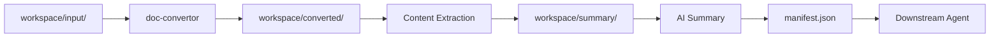

[English](README.md) | [中文](README_CN.md)

<div align="center">

# 📖 doc-content-analysis

**Document Content Reading & Analysis Agent**

*Batch convert, extract, and summarize content from DOC/DOCX/PDF documents with structured JSON output for multi-agent integration.*

[](https://www.python.org/downloads/)
[](LICENSE)
[](https://www.microsoft.com/windows)

[Quick Start](#quick-start) · [Features](#features) · [Architecture](#architecture) · [Multi-Agent Integration](#multi-agent-integration)

</div>

---

## Why doc-content-analysis?

Batch document summarization is a core capability for knowledge base generation. **doc-content-analysis** provides a complete pipeline for converting, extracting, and summarizing multiple documents:

| Challenge | Solution |
|-----------|----------|
| ❌ Manual reading of multiple documents | ✅ Batch processing pipeline |
| ❌ PDF/DOC format incompatibility | ✅ Unified DOCX conversion |
| ❌ No structured output for downstream | ✅ JSON + MD dual output |
| ❌ Image content locked in documents | ✅ Image extraction + OCR |
| ❌ No processing traceability | ✅ manifest.json tracking |

---

## Features

### 🎯 Core Capabilities

- **Batch Processing** - Process multiple DOC/DOCX/PDF/TXT files in one run
- **Format Conversion** - Automatic `.doc` → `.docx`, `.pdf` → `.docx` conversion
- **Content Extraction** - Extract paragraphs, headings, tables, and metadata
- **Image Extraction** - Extract all embedded images from documents
- **Dual Output** - Structured JSON (for agents) + readable MD (for humans)

### 📄 Format Support

| Format | Extension | Processing |
|--------|-----------|------------|
| Microsoft Word (legacy) | `.doc` | Convert to .docx via win32com/LibreOffice |
| Microsoft Word | `.docx` | Direct content extraction |
| PDF | `.pdf` | Convert to .docx via pdf2docx |
| Plain Text | `.txt` | Direct text extraction |

### 🔧 Processing Pipeline



### 📊 Output Structure

```
workspace/summary/
├── manifest.json              # Processing manifest (for orchestrator)
├── <doc_name>/
│   ├── text/
│   │   ├── content.json       # Structured document content
│   │   ├── summary.json       # Structured summary (for agents)
│   │   └── summary.md         # Readable summary (for humans)
│   └── img/
│       ├── image_1.png
│       ├── text/              # OCR results (optional)
│       └── img-summary/       # AI vision summary (optional)
└── 综合总结.json               # Combined summary (multi-doc)
```

---

## Quick Start

### 1. Install

```bash
cd doc-content-analysis
pip install -r requirements.txt
```

### 2. Place Documents

```bash
# Copy your documents to workspace/input/
cp /path/to/documents/*.docx workspace/input/
```

### 3. Run

```bash
# Load AGENT.md in your AI IDE (Trae, Cursor, Windsurf)
# The agent will automatically:
# 1. Convert .doc/.pdf to .docx
# 2. Extract content and images
# 3. Generate structured summaries
# 4. Output manifest.json for downstream consumption
```

---

## Multi-Agent Integration

This agent is designed to operate as part of a multi-agent project:

### Input Contract

```
workspace/input/
├── *.doc        # Legacy Word documents
├── *.docx       # Word documents
├── *.pdf        # PDF documents
└── *.txt        # Plain text files
```

### Output Contract

**manifest.json** — The orchestrator reads this file to get processing results:

```json
{
  "status": "completed",
  "total_files": 3,
  "success_count": 2,
  "failed_count": 1,
  "documents": [
    {
      "source_file": "report.docx",
      "status": "success",
      "summary_json": "workspace/summary/report/text/summary.json",
      "summary_md": "workspace/summary/report/text/summary.md"
    }
  ]
}
```

**summary.json** — Structured summary for downstream agent consumption:

```json
{
  "title": "Document Title",
  "summary": "One-paragraph overview...",
  "sections": [{"heading": "...", "key_points": ["..."]}],
  "key_info": {"data": ["..."], "conclusions": ["..."]},
  "keywords": ["keyword1", "keyword2"]
}
```

---

## Project Structure

```
doc-content-analysis/
├── AGENT.md                     # Agent configuration
├── SKILLS/
│   ├── doc-convertor/           # Document conversion & extraction
│   │   ├── SKILL.MD
│   │   └── scripts/doc_converter.py
│   └── img-reader/              # Image OCR & vision analysis
│       ├── SKILL.MD
│       └── scripts/img_reader.py
├── workspace/                   # Runtime workspace
│   ├── input/                   # User documents (read-only)
│   ├── converted/               # Converted .docx files
│   └── summary/                 # Output summaries
└── requirements.txt             # Dependencies
```

---

## Documentation

- [Agent Configuration](AGENT.md) - Workflow and integration contract
- [doc-convertor Skill](SKILLS/doc-convertor/SKILL.MD) - Conversion and extraction
- [img-reader Skill](SKILLS/img-reader/SKILL.MD) - Image OCR and analysis

---

## License

This project is licensed under the GPL-3.0 License.

---

<div align="center">

**Part of DocMind Studio Multi-Agent System**

[⬆ Back to top](#-doc-content-analysis)

</div>
