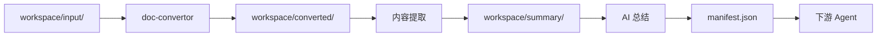

[English](README.md) | [中文](README_CN.md)

<div align="center">

# 📖 doc-content-analysis

**文档内容读取与分析智能体**

*批量转换、提取和总结 DOC/DOCX/PDF 文档内容，输出结构化 JSON 供多 Agent 项目集成。*

[](https://www.python.org/downloads/)
[](LICENSE)
[](https://www.microsoft.com/windows)

[快速开始](#快速开始) · [功能特性](#功能特性) · [架构设计](#架构设计) · [多 Agent 集成](#多-agent-集成)

</div>

---

## 为什么选择 doc-content-analysis？

批量文档总结是知识库生成的核心能力。**doc-content-analysis** 提供了完整的文档转换、提取和总结流水线：

| 痛点 | 解决方案 |
|------|----------|
| ❌ 手动阅读多个文档 | ✅ 批量处理流水线 |
| ❌ PDF/DOC 格式不兼容 | ✅ 统一 DOCX 转换 |
| ❌ 无结构化输出供下游使用 | ✅ JSON + MD 双输出 |
| ❌ 图片内容锁定在文档中 | ✅ 图片提取 + OCR |
| ❌ 无处理可追溯性 | ✅ manifest.json 追踪 |

---

## 功能特性

### 🎯 核心能力

- **批量处理** - 一次运行处理多个 DOC/DOCX/PDF/TXT 文件
- **格式转换** - 自动 `.doc` → `.docx`、`.pdf` → `.docx` 转换
- **内容提取** - 提取段落、标题、表格和元数据
- **图片提取** - 提取文档中所有嵌入图片
- **双输出** - 结构化 JSON（供 Agent）+ 可读 MD（供人类）

### 📄 格式支持

| 格式 | 扩展名 | 处理方式 |
|------|--------|----------|
| Microsoft Word（旧版） | `.doc` | 通过 win32com/LibreOffice 转换为 .docx |
| Microsoft Word | `.docx` | 直接内容提取 |
| PDF | `.pdf` | 通过 pdf2docx 转换为 .docx |
| 纯文本 | `.txt` | 直接文本提取 |

### 🔧 处理流水线



### 📊 输出结构

```
workspace/summary/
├── manifest.json              # 处理清单（供调度器）
├── <文件名>/
│   ├── text/
│   │   ├── content.json       # 结构化文档内容
│   │   ├── summary.json       # 结构化总结（供 Agent）
│   │   └── summary.md         # 可读总结（供人类）
│   └── img/
│       ├── image_1.png
│       ├── text/              # OCR 结果（可选）
│       └── img-summary/       # AI 视觉总结（可选）
└── 综合总结.json               # 综合总结（多文档）
```

---

## 快速开始

### 1. 安装

```bash
cd doc-content-analysis
pip install -r requirements.txt
```

### 2. 放置文档

```bash
# 将文档复制到 workspace/input/
cp /path/to/documents/*.docx workspace/input/
```

### 3. 运行

```bash
# 在 AI IDE（Trae、Cursor、Windsurf）中加载 AGENT.md
# Agent 将自动：
# 1. 转换 .doc/.pdf 为 .docx
# 2. 提取内容和图片
# 3. 生成结构化总结
# 4. 输出 manifest.json 供下游消费
```

---

## 多 Agent 集成

本 Agent 设计为多 Agent 项目的组成部分：

### 输入契约

```
workspace/input/
├── *.doc        # 旧版 Word 文档
├── *.docx       # Word 文档
├── *.pdf        # PDF 文档
└── *.txt        # 纯文本文件
```

### 输出契约

**manifest.json** — 调度器读取此文件获取处理结果：

```json
{
  "status": "completed",
  "total_files": 3,
  "success_count": 2,
  "failed_count": 1,
  "documents": [
    {
      "source_file": "report.docx",
      "status": "success",
      "summary_json": "workspace/summary/report/text/summary.json",
      "summary_md": "workspace/summary/report/text/summary.md"
    }
  ]
}
```

**summary.json** — 结构化总结供下游 Agent 消费：

```json
{
  "title": "文档标题",
  "summary": "一段话概述...",
  "sections": [{"heading": "...", "key_points": ["..."]}],
  "key_info": {"data": ["..."], "conclusions": ["..."]},
  "keywords": ["关键词1", "关键词2"]
}
```

---

## 项目结构

```
doc-content-analysis/
├── AGENT.md                     # Agent 配置
├── SKILLS/
│   ├── doc-convertor/           # 文档转换与提取
│   │   ├── SKILL.MD
│   │   └── scripts/doc_converter.py
│   └── img-reader/              # 图片 OCR 与视觉分析
│       ├── SKILL.MD
│       └── scripts/img_reader.py
├── workspace/                   # 运行时工作区
│   ├── input/                   # 用户文档（只读）
│   ├── converted/               # 转换后的 .docx
│   └── summary/                 # 输出总结
└── requirements.txt             # 依赖项
```

---

## 文档

- [Agent 配置](AGENT.md) - 工作流和集成契约
- [doc-convertor 技能](SKILLS/doc-convertor/SKILL.MD) - 转换和提取
- [img-reader 技能](SKILLS/img-reader/SKILL.MD) - 图片 OCR 和分析

---

## 许可证

本项目采用 GPL-3.0 许可证。

---

<div align="center">

**DocMind Studio 多 Agent 系统的组成部分**

[⬆ 回到顶部](#-doc-content-analysis)

</div>
