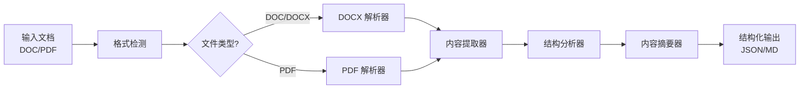

[English](README.md) | [中文](README_CN.md)

<div align="center">

# 📖 doc-content-analysis

**文档内容读取与分析智能体**

*轻松提取、解析和分析 DOC 和 PDF 文档内容，AI 驱动的智能文档处理。*

[](https://www.python.org/downloads/)
[](LICENSE)
[](https://www.microsoft.com/windows)

[快速开始](#快速开始) · [功能特性](#功能特性) · [架构设计](#架构设计) · [文档](#文档)

</div>

---

## 为什么选择 doc-content-analysis？

提取和理解文档内容是智能文档处理的基础。**doc-content-analysis** 提供了一套强大的模块化流水线，用于读取和分析 DOC/DOCX 及 PDF 文件：

| 痛点 | 解决方案 |
|------|----------|
| ❌ 手动复制粘贴阅读 | ✅ 自动化文档解析 |
| ❌ PDF 提取文本丢失排版 | ✅ 智能布局感知提取 |
| ❌ 混合内容（文本、表格、图片） | ✅ 结构化内容输出 |
| ❌ 跨文档对比困难 | ✅ 统一内容表示 |
| ❌ 缺少元数据和结构信息 | ✅ 丰富的文档元数据提取 |

---

## 功能特性

### 🎯 核心能力

- **多格式支持** - 无缝读取 DOC/DOCX 和 PDF 文档
- **智能内容提取** - 提取文本、表格、图片、页眉页脚和元数据
- **结构化输出** - 生成结构化的 JSON 文档内容表示
- **非破坏性处理** - 永远不会修改原始文件

### 📄 格式支持

| 格式 | 扩展名 | 说明 |
|------|--------|------|
| Microsoft Word | `.doc`, `.docx` | 完整保留结构的 Word 文档 |
| PDF | `.pdf` | 布局感知提取的便携式文档格式 |
| 纯文本 | `.txt` | 纯文本文件读取和处理 |

### 🔧 处理功能

- **DOC/DOCX 解析** - 提取段落、标题、表格、图片、超链接和样式
- **PDF 解析** - 提取文本块、表格、图片，支持页面级内容和布局分析
- **元数据提取** - 标题、作者、创建日期、修改日期、页数
- **内容摘要** - AI 驱动的文档摘要和关键信息提取
- **表格提取** - 检测并提取表格，保留行列结构
- **标题层级** - 检测并重建文档标题层级结构

### 📊 分析功能

- **文档结构分析** - 识别文档章节、段落和逻辑流程
- **关键信息提取** - 提取重要实体、日期、数字和引用
- **内容质量评估** - 评估文档完整性和结构质量

---

## 快速开始

### 1. 安装

```bash
# 克隆仓库
git clone https://github.com/yourusername/doc-content-analysis.git
cd doc-content-analysis

# 安装依赖
pip install -r requirements.txt
```

### 2. 运行

```bash
# 打开 AI IDE 或 Agent 软件（如 Trae、Cursor、Windsurf）
# 加载 AGENT.md 作为智能体配置
# 然后输入您的需求：
"读取并总结这个 DOCX 文件"
"提取这个 PDF 中的所有表格"
"分析这份报告的文档结构"
```

### 3. 完成！

分析结果将在 `workspace/output/` 中

---

## 演示

```
┌─────────────────────────────────────────────────────────────┐
│  📂 输入：research_paper.docx / report.pdf                 │
├─────────────────────────────────────────────────────────────┤
│  ↓ doc-content-analysis 处理中...                           │
│    ✓ 检测文件格式                                            │
│    ✓ 解析文档结构                                            │
│    ✓ 提取文本内容                                            │
│    ✓ 提取表格和图片                                          │
│    ✓ 构建内容大纲                                            │
│    ✓ 生成分析报告                                            │
├─────────────────────────────────────────────────────────────┤
│  📊 输出：content_analysis.json / summary.md                │
└─────────────────────────────────────────────────────────────┘
```

---

## 架构设计



---

## 项目结构

```
doc-content-analysis/
├── AGENT.md                 # 智能体配置
├── SKILLS/                  # 模块化处理技能
│   ├── docx-parser/         # DOCX 文档解析
│   ├── pdf-parser/          # PDF 文档解析
│   ├── content-extractor/   # 统一内容提取
│   ├── structure-analyzer/  # 文档结构分析
│   └── content-summarizer/  # AI 智能摘要
├── workspace/               # 您的文档
│   ├── input/               # 放入文件
│   └── output/              # 获取结果
└── requirements.txt         # 依赖项
```

---

## 文档

- [智能体配置](AGENT.md) - 详细的处理规则和工作流程
- [技能参考](SKILLS/) - 技能模块文档

---

## 贡献

欢迎贡献！请随时提交 Pull Request。

1. Fork 仓库
2. 创建功能分支 (`git checkout -b feature/amazing-feature`)
3. 提交更改 (`git commit -m 'Add amazing feature'`)
4. 推送到分支 (`git push origin feature/amazing-feature`)
5. 提交 Pull Request

---

## 许可证

本项目采用 GPL-3.0 许可证 - 详见 [LICENSE](LICENSE) 文件。

---

<div align="center">

**为文档智能而用心打造 ❤️**

[⬆ 回到顶部](#-doc-content-analysis)

</div>
